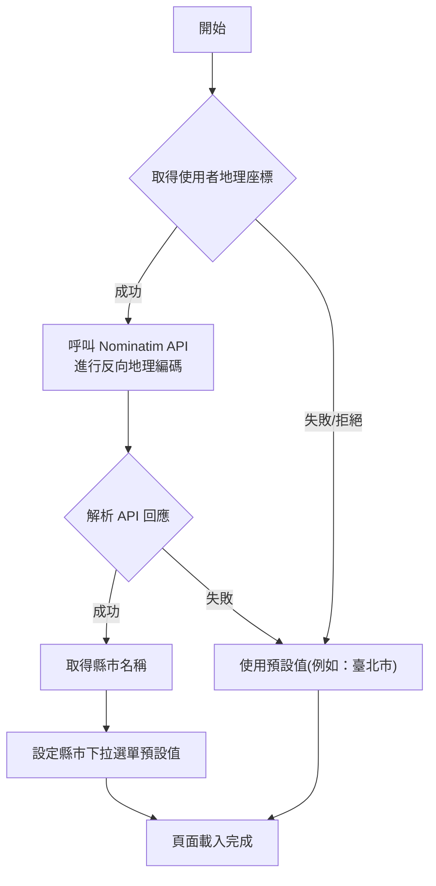

# 程式流程圖

## 網頁載入與初始化流程

```mermaid
graph TD
    A["開始"] --> B{"取得使用者地理座標"};
    B -- "成功" --> C["呼叫 Nominatim API<br>進行反向地理編碼"];
    B -- "失敗/拒絕" --> D["使用預設值(例如：臺北市)"];
    C --> E{"解析 API 回應"};
    E -- "成功" --> F["取得縣市名稱"];
    F --> G["設定縣市下拉選單預設值"];
    E -- "失敗" --> D;
    G --> H["頁面載入完成"];
    D --> H;
```

## 使用者查詢流程

```mermaid
graph TD
    subgraph "單一縣市查詢"
        A["使用者選擇縣市、<br>輸入車號、選擇車種"] --> B["點擊「查詢」按鈕"];
        B --> C["前端 JS 發送請求到 Flask 後端<br>(/query)"];
        C --> D["Flask 後端依據縣市<br>呼叫對應的停車費 API"];
        D --> E{"API 回應"};
        E -- "成功 (2秒內)" --> F["後端將資料回傳給前端"];
        E -- "逾時/失敗" --> G["後端回傳錯誤訊息給前端"];
        F --> H["前端顯示查詢結果"];
        G --> H;
        H --> I["將結果存入 Local Storage"];
    end

    subgraph "全國一鍵查詢"
        J["使用者點擊<br>「一鍵查詢全國」按鈕"] --> K["前端 JS 發送請求到 Flask 後端<br>(/query-all)"];
        K --> L["後端開始遍歷所有縣市 API"];
        L --> M{"For each 縣市"};
        M -- "Yes" --> N["呼叫該縣市 API<br>(2秒超時)"];
        N --> O["等待 1 秒"];
        O --> L;
        M -- "No" --> P["彙總所有成功查詢的結果"];
        P --> Q["後端將整合資料回傳給前端"];
        Q --> R["前端顯示所有結果"];
        R --> S["將結果存入 Local Storage"];
    end
``` 